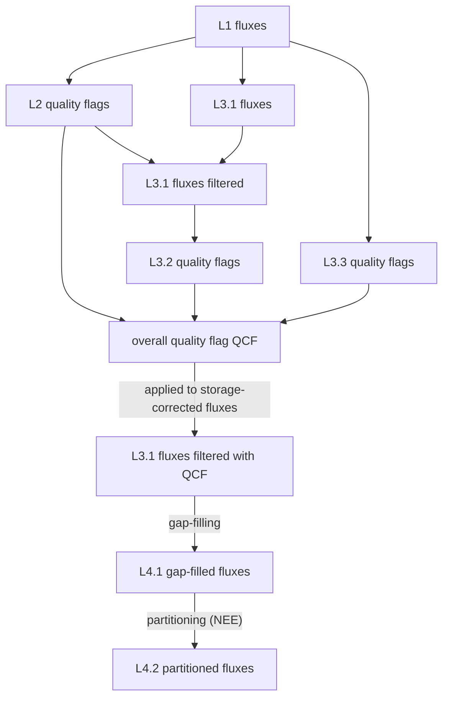
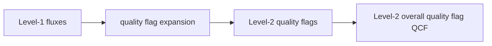
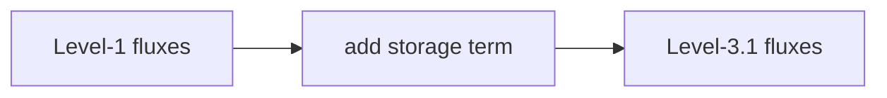
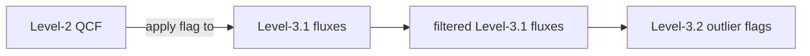

# Flux Post-processing

- Post-processing follows the [Swiss Fluxnet Flux Processing Chain](https://www.swissfluxnet.ethz.ch/index.php/data/ecosystem-fluxes/flux-processing-chain/)


## Overview



- **Level-2** creates additional quality flags that are then combined to one overall quality flag `QCF` (quality control flag)
- **Level-3.1** adds the storage term to the respective flux
- **Level-3.2** detects outliers and creates additional quality flags
- **Level-3.3** creates additional quality flags based on three different constant USTAR thresholds, previously detected by FLUXNET (Pastorello et al., 2020)
- **Level-4.1** performs gap-filling (long-term random forest)
- (planned) **Level-4.2** partitions NEE fluxes into GPP and RECO

## Flux processing chain notebooks
- NEE: [41.0_FluxProcessingChain_L3.3_NEE_QCF10.ipynb](../notebooks/40_FLUX_PROCESSING_CHAIN/41.0_FluxProcessingChain_L3.3_NEE_QCF10.ipynb)
- LE: [42.0_FluxProcessingChain_L3.3_LE_QCF11.ipynb](../notebooks/40_FLUX_PROCESSING_CHAIN/42.0_FluxProcessingChain_L3.3_LE_QCF11.ipynb)
- H: [43.0_FluxProcessingChain_L3.3_H_QCF11.ipynb](../notebooks/40_FLUX_PROCESSING_CHAIN/43.0_FluxProcessingChain_L3.3_H_QCF11.ipynb)
- N2O flux: [51.0_FluxProcessingChain_L3.3_FN2O_QCF11.ipynb](../notebooks/50_FLUX_PROCESSING_CHAIN_QCL+LGR/51.0_FluxProcessingChain_L3.3_FN2O_QCF11.ipynb)
- CH4 flux: [52.0_FluxProcessingChain_L3.3_FCH4_QCF11.ipynb](../notebooks/50_FLUX_PROCESSING_CHAIN_QCL+LGR/52.0_FluxProcessingChain_L3.3_FCH4_QCF11.ipynb)

## Level 2: Quality flag expansion



### General

- **Level-2 creates additional quality flags.**
- Based on Level-1 (final) flux calculations
- Builds upon flux results (*_fluxnet_* files) from EddyPro
- The `SSITC` flag from EddyPro is expanded with results from additional quality flags.
- All individual quality flags are combined into one overall quality flag `QCF`.
- The `QCF` flag uses a `0-1-2` system, where
	- `0` = best quality data
	- `1` = medium quality data
	- `2` = bad quality data, reject in all cases

### Individual flags
*See notebooks for more details*
#### **SSITC** test flag
- Combination of the two partial tests _steady state test_ and _developed turbulent conditions test_, from EddyPro output. (Mauder and Foken, 2006)
	- applied to: all fluxes
	- **Exception**: flags where this test resulted in `1` were set to `2` during the time period between `2022-05-01` and `2023-09-30`. 
		- During this time period, there was a strange issue with the sonic anemometer where the vertical wind component `W_UNROT` (unrotated, the directly measured W) became  negative while during all other time periods the wind was more positive. NEE was clearly affected by this issue, showing some high uptake values during night, therefore also corrupting the gap-filling algorithm later on. Although this was not so visible during the day, we must assume that this effect was also present during daytime. We found that the most problematic time periods can be filtered out by setting the SSITC flag to `2` where the flag was `1`. Therefore we remove all flux values where the SSITC test was `1`. This issue is also visible in the second rotation angle `ROT_PITCH` with slightly different angles than before and after this period. 
	- Example output from diive for NEE (in this step still called `FC`): 
	  ```
	  SSITC TEST: Generated new flag variable FLAG_L2_FC_SSITC_TEST, values taken from output variable FC_SSITC_TEST ...
	  ```
#### **Gas completeness** test flag
- Check completeness of the variable that was used to calculate the respective flux, calculated in diive. (Sabbatini et al., 2018)
	- applied to: all fluxes
	- Example output from diive for NEE (in this step still called `FC`): 
	  ```
	  FLUX BASE VARIABLE COMPLETENESS TEST: Generated new flag variable FLAG_L2_FC_COMPLETENESS_TEST, newly calculated from variable CO2, with flag 0 (good values) where available number of records for CO2 >= 0.99, flag 1 (ok values) >= 0.97 and < 0.99, flag 2 (bad values) < 0.97...
	  ```
#### **Spectral correction factor** test flag
- using the `SCF` (spectral correction factor) from EddyPro output, then calculated in diive (Sabbatini et al., 2018)
	- applied to: all fluxes
	- Example output from diive for NEE (in this step still called `FC`): 
	  ```
	  SPECTRAL CORRECTION FACTOR TEST: Generating new flag variable FLAG_L2_FC_SCF_TEST, newly calculated from output variable FC_SCF, withflag 0 (good values) where FC_SCF < 2, flag 1 (ok values) where FC_SCF >= 2 and < 4, flag 2 (bad values) where FC_SCF >= 4...
	  ```
#### **Signal strength** test flag
- for open path IRGAs, this test checks if the instrument's `AGC` (automatic gain control, a measure of signal quality) is above a certain value, whereby high values stand for bad signal (note that for (en)closed path IRGAs it is typically the other way round with high values showing good signal strenth), fluxes where `AGC` was above 90% were discarded. In this case, the name of the custom variable was `CUSTOM_AGC_MEAN` and part of the EddyPro output files, the flag was then calculated in diive.
	- applied to: open path IRGA fluxes (CO<sub>2</sub>, H<sub>2</sub>O)
	- Note that the water fluxes `LE` and `ET` are direct conversions of the calculated H<sub>2</sub>O flux
	- Example output from diive for NEE (in this step still called `FC`): 
	  ```
	  SIGNAL STRENGTH TEST: Generating new flag variable FLAG_L2_FC_SIGNAL_STRENGTH_TEST, newly calculated from output variable CUSTOM_AGC_MEAN, with flag 0 (good values) where CUSTOM_AGC_MEAN <= 90, flag 2 (bad values) where CUSTOM_AGC_MEAN > 90 ...
	  ```
#### **Raw data screening** test flags (multiple)
- applied results from the EddyPro output file for spikes, amplitude and drop-outs, see also the official EddyPro help for more info [here](https://www.licor.com/support/EddyPro/topics/despiking-raw-statistical-screening.html). (Vickers and Mahrt, 1997)
	- applied to: all fluxes
	- Example output from diive for NEE (in this step still called `FC`): 
	  ```
	  RAW DATA TEST: Generated new flag variable FLAG_L2_FC_CO2_VM97_SPIKE_HF_TEST, values taken from output variable CO2_VM97_TEST from position 1, based on CO2, with flag 0 (good values) where test passed, flag 2 (bad values) where test failed (for hard flags) or flag 1 (ok values) where test failed (for soft flags) ...
	  ```
	
	  ```
	  RAW DATA TEST: Generated new flag variable FLAG_L2_FC_CO2_VM97_AMPLITUDE_RESOLUTION_HF_TEST, values taken from output variable CO2_VM97_TEST from position 2, based on CO2, with flag 0 (good values) where test passed, flag 2 (bad values) where test failed (for hard flags) or flag 1 (ok values) where test failed (for soft flags) ...
	  ```

	  ```
	  RAW DATA TEST: Generated new flag variable FLAG_L2_FC_CO2_VM97_DROPOUT_TEST, values taken from output variable CO2_VM97_TEST from position 3, based on CO2, with flag 0 (good values) where test passed, flag 2 (bad values) where test failed (for hard flags) or flag 1 (ok values) where test failed (for soft flags) ...
	  ```

#### **Angle-of-attack (AoA) flag** 
- The AoA flag was only applied during certain time periods:
		- between `2008-01-01` and `2010-01-01`
		- between `2016-03-01` and `2016-05-01`
		- between `2021-12-10` and `2021-12-23`
	- All time periods when the flag indicated issues with AoA were flagged as bad data. 
	- Normally not applied by default, but in this case there were time periods when the sonic's vertical wind velocity produced unrealistic wind values. 
	- applied to: all fluxes
	- Note: for flux calculations, the setting in EddyPro was relaxed and accepted minimum and maximum angles of attack of `-35°` and `+35°`, respectively, instead of the default `-30°` and `+30°`. Reason: this test is relatively strict and removes many data points, however, based on tests from another group the relaxed settings seemed defensible, especially since this flag was only applied to obviously flawed time periods.
	- Example output from diive for NEE (in this step still called `FC`): 
	  ```
	  ANGLE OF ATTACK TEST: will be applied on the following dates only: [['2008-01-01', '2010-01-01'], ['2016-03-01', '2016-05-01']]
	  ANGLE OF ATTACK TEST: Generated new flag variable FLAG_L2_FC_VM97_AOA_HF_TEST, values taken from output variable None, with flag 0 (good values) where test passed, flag 2 (bad values) where test failed ...
	  ```
### QCF: overall quality control flag after Level-2 tests
*See below for a description of how `QCF` is calculated.*
- **Single flags from Level-2 are combined into one quality control flag `QCF` that is later *temporarily* applied before outlier detection tests (Level-3.2).

## Level 3.1: Storage correction



- **Level-3.1 calculates storage-corrected fluxes.**
- Added storage term from *single point measurement* to the respective flux
- The storage term was calculated by EddyPro during flux calculations (Level-1)
- Storage-corrected fluxes are: `NEE_L3.1` (from `FC`), `LE_L3.1` (from `LE`), `H_L3.1` (from `H`), `FN2O_L3.1` (from `FN2O`), `FCH4_L3.1` (from `FCH4`)
- The suffix `_L3.1` is added to all fluxes to make it clear that the respective flux is storage corrected. Only for `NEE` it is clear that it is the storage-corrected flux because the name changes from `FC` to `NEE` after the correction, but all other variables do not have such a name change, thus the suffix.
- Note that the overall quality flag from Level-2 is not used here
- Example output from diive for NEE (in this step still called `FC`, after the storage correction this becomes `NEE_L3.1`): 
```
========================================
REPORT: STORAGE CORRECTION FOR FC
========================================
Swiss FluxNet processing chain, _L3.1: Storage Correction

The gap-filled storage term SC_SINGLE_gfRMED_L3.1 was added to flux FC.
The storage-corrected flux was stored as NEE_L3.1.

The flux was available for 295350 records (FC).
The original, non-gapfilled storage term was available for 290861 records (SC_SINGLE).
The original storage term SC_SINGLE was missing for 7259 flux records.
Without gap-filling the storage term (SC_SINGLE), 7259 measured flux records (FC) are lost.

For this run, gap-filling of SC_SINGLE was * SELECTED *.
After gap-filling the storage term, it was available for an additional 7259 records (SC_SINGLE_gfRMED_L3.1).

In the storage-corrected flux NEE_L3.1 with 295350 records, 
  - 97.5% (290861 records) of used storage terms come from originally calculated data (SC_SINGLE)
  - 2.5% (7259 records) of used storage terms come from gap-filled data (SC_SINGLE_gfRMED_L3.1)

Stats for gap-filled storage terms:
                        NOV       P01    MEDIAN       P99
SC_SINGLE_gfRMED_L3.1  7259 -8.395369 -0.167553  6.810566

Stats for measured storage terms:
                          NOV       P01    MEDIAN       P99
SC_SINGLE_gfRMED_L3.1  288091 -7.555871 -0.015403  6.739739
```

## Level 3.2: Outlier removal



- **Level-3.2 creates additional quality flags.**
- The overall quality flag `QCF` from Level-2 is applied to Level-3.1 fluxes to remove fluxes of low quality before outlier detection. This is a *temporary* application for outlier removal detection only. This way the outlier removal functions do not take into account values that were already flagged for removal in Level-2.

Generally, the following outlier tests were used. The tests were run sequentially, so that results from one test were based on results from the previous test.

### Description of outlier functions

- **Absolute limits**: flag values outside a physically plausible range. 
- **Manual flag**: flag specific time periods, e.g., due to known instrument failure
- **Hampel filter**, separate for daytime and nighttime. The Hampel filter identifies anomalies in time-series data using a sliding window of adjustable size. Within each window, it compares each data point to the Median Absolute Deviation (MAD). Points exceeding the MAD by a specified multiple (adjustable) are flagged as outliers.
- **Local standard deviation**, with rolling median and _constant_ standard deviation (SD). SD was calculated across all data and then used in combination with the rolling window.
- **Local outlier factor**, separate for daytime and nighttime. Local Outlier Factor (LOF) is an unsupervised anomaly detection method. It calculates an anomaly score based on the local density deviation of a sample compared to its k-nearest neighbors. Samples with significantly lower density than their neighbors are identified as outliers. See also the official description [here](https://scikit-learn.org/stable/modules/generated/sklearn.neighbors.LocalOutlierFactor.html).
- **Rolling z-score**, identify outliers based on the rolling z-score of records. For each record, the rolling z-score is calculated from the rolling mean and rolling standard deviation, centered on the respective value.

### Outlier detection settings

Outlier methods are given for each flux in the order of sequential application.

#### NEE (net ecosystem exchange of CO<sub>2</sub>)
Units: µmol CO<sub>2</sub> m<sup>-2</sup> s<sup>-1</sup>
1. **Absolute limits**: flag data outside `[-50, 50]`
2. **Manual flag**: flag data between the two dates `['2008-12-01', '2009-05-01']`
3. **Hampel filter** separate for daytime and nighttime with the settings `window_length=48*13` (corresponds to 13 days of half-hourly data), `n_sigma_dt=3.5` and `n_sigma_nt=3.5` (same n_sigma for daytime and nighttime). This test worked well for NEE. Test repeated until all outliers removed.
4. **Local standard deviation**, with rolling median and _constant_ standard deviation with the settings `n_sd=3.5` and `winsize=48*13`. Test repeated until all outliers removed.

#### LE (latent heat)
Units: W m<sup>-2</sup>
1. **Absolute limits**: flag data outside `[-50, 800]`
2. **Manual flag**: flag data between the two dates `['2008-12-01', '2009-05-01']`
3. **Hampel filter** separate for daytime and nighttime with the settings `window_length=48*13` (corresponds to 13 days of half-hourly data), `n_sigma_dt=3.5` and `n_sigma_nt=3.5` (same n_sigma for daytime and nighttime). Test repeated until all outliers removed.
4. **Local standard deviation**, with rolling median and _constant_ standard deviation with the settings `n_sd=4.5` and `winsize=48*13`. Test repeated until all outliers removed.
5. **Local outlier factor**, separate for daytime and nighttime with the settings `n_neighbors=50` and `contamination=None`. Test not repeated, only run once.

#### H (sensible heat)
Units: W m<sup>-2</sup>
1. **Absolute limits**: flag data outside `[-200, 400]`
2. **Manual flag**: flag data between the two dates `['2008-12-01', '2009-05-01']`
3. **Hampel filter** separate for daytime and nighttime with the settings `window_length=48*13` (corresponds to 13 days of half-hourly data), `n_sigma_dt=3.5` and `n_sigma_nt=3.5` (same n_sigma for daytime and nighttime). Test repeated until all outliers removed.
4. **Local standard deviation**, with rolling median and _constant_ standard deviation with the settings `n_sd=5` and `winsize=48*13`. Test repeated until all outliers removed.

#### FN2O (nitrous oxide flux)
Units: nmol N<sub>2</sub>O m<sup>-2</sup> s<sup>-1</sup>
1. **Absolute limits**: flag data outside `[-5, 70]`
2. **Rolling z-score**, with the settings `winsize=48*3` and `thres_zscore=10`. Test repeated until all outliers removed.
3. **Local standard deviation**, with rolling median and _rolling_ standard deviation with the settings `n_sd=8` and `winsize=48*3`. Test repeated until all outliers removed.

#### FCH4 (methane flux)
Units: nmol CH<sub>4</sub> m<sup>-2</sup> s<sup>-1</sup>
1. **Absolute limits**: flag data outside `[-100, 1100]`
2. **Rolling z-score**, with the settings `winsize=48*3` and `thres_zscore=8`. Test repeated until all outliers removed. 
3. **Local standard deviation**, with rolling median and _rolling_ standard deviation with the settings `n_sd=7` and `winsize=48*3`. Test repeated until all outliers removed.

## Level 3.3: USTAR filtering

- Remove fluxes during time periods of low turbulence
- Fluxes filtered with USTAR threshold: `NEE`, `FN2O`, `FCH4`
- Fluxes _not_ filtered: `LE`, `H`; see reasoning in Pastorello et al. (2020):  
    
    > The USTAR filtering is not applied to H and LE, because it has not been proved that when there are CO2 advective fluxes, these also impact energy fluxes, specifically due to the fact that when advection is in general large (nighttime), energy fluxes are small.
    
- A constant USTAR threshold (`CUT`) was used for all years (same threshold for all years)
- Threshold values are based on USTAR detection results from the most recent FLUXNET data product (2024)
- The threshold detection was done by FLUXNET, using data between 2005 and 2023 and using the method described in Pastorello et al. (2020)
- Following Pastorello et al. (2020), three USTAR scenarios were considered to calculate three NEE versions:
    - `CUT_50`: This is the main NEE version (best estimate) with a constant USTAR threshold of `0.069898`, corresponding to the 50th percentile from the FLUXNET detection results
    - `CUT_16`: NEE version with a constant USTAR threshold of `0.052945`, corresponding to the 16th percentile from the FLUXNET detection results
    - `CUT_84`: NEE version with a constant USTAR threshold of `0.092841`, corresponding to the 84th percentile from the FLUXNET detection results
    - The two other scenarios use a slightly lower and higher threshold.

## QCF: overall quality control flag after Level-3.3 tests
*See below for a description of how `QCF` is calculated.*
- **For subsequent steps, fully quality-filtered fluxes are needed.**
- Therefore, after running the individual quality tests in previous steps, the single flags are combined into the overall `QCF`.
- This creates flux variables that have been filtered by all quality flags created in Level-2, Level-3.2 and Level-3.3.
- The overall quality flag after Level-3.3 is named `FLAG_L3.3_<ustar_scenario>_<flux>_QCF`.
- **Example** for NEE: 
	- `FLAG_L3.3_CUT_50_NEE_L3.1_QCF` is the `QCF` for `NEE_L3.1` after Level-3.3.
	- This flag is used to filter the variable `NEE_L3.1` and creates the quality-filtered variable `NEE_L3.1_L3.3_CUT_50_QCF`, that is then used in the following steps.
	- Note that `NEE_L3.1` is the unfiltered, but storage-corrected variable `FC` from the flux calculations.
- **Examples** for `<ustar_scenario>`:
	- `CUT_16`, `CUT_50`, `CUT_84`
- **Examples** for `<flux>`:
	- `FC_L3.1`, `LE_L3.1`, `H_L3.1`, `FN2O_L3.1`, `FCH4_L3.1`
	- These are fluxes that are storage-corrected (Level-3.1), but are not filtered yet.
- **Example** output from diive for `NEE_L3.1` (storage-corrected `FC` from Level-3.1) for the USTAR scenario `CUT_50`, detailing the sequential application of all individual quality flags from Level-2, Level-3.2 and Level-3.3: 
```
========================================
QCF FLAG EVOLUTION
========================================
This output shows the evolution of the QCF overall quality flag
when test flags are applied sequentially to the variable NEE_L3.1.

Number of NEE_L3.1 records before QC: 295350
+++ FLAG_L2_FC_MISSING_TEST rejected 0 values (+0.00%)      TOTALS: flag 0: 295350 (100.00%) / flag 1: 0 (0.00%) / flag 2: 0 (0.00%)
+++ FLAG_L2_FC_SSITC_TEST rejected 133899 values (+45.34%)      TOTALS: flag 0: 115080 (38.96%) / flag 1: 46371 (15.70%) / flag 2: 133899 (45.34%)
+++ FLAG_L2_FC_COMPLETENESS_TEST rejected 690 values (+0.23%)      TOTALS: flag 0: 114423 (38.74%) / flag 1: 46338 (15.69%) / flag 2: 134589 (45.57%)
+++ FLAG_L2_FC_SCF_TEST rejected 194 values (+0.07%)      TOTALS: flag 0: 114201 (38.67%) / flag 1: 46366 (15.70%) / flag 2: 134783 (45.64%)
+++ FLAG_L2_FC_SIGNAL_STRENGTH_TEST rejected 9808 values (+3.32%)      TOTALS: flag 0: 110029 (37.25%) / flag 1: 40730 (13.79%) / flag 2: 144591 (48.96%)
+++ FLAG_L2_FC_CO2_VM97_SPIKE_HF_TEST rejected 942 values (+0.32%)      TOTALS: flag 0: 109335 (37.02%) / flag 1: 40482 (13.71%) / flag 2: 145533 (49.27%)
+++ FLAG_L2_FC_CO2_VM97_AMPLITUDE_RESOLUTION_HF_TEST rejected 3826 values (+1.30%)      TOTALS: flag 0: 106807 (36.16%) / flag 1: 39184 (13.27%) / flag 2: 149359 (50.57%)
+++ FLAG_L2_FC_CO2_VM97_DROPOUT_TEST rejected 0 values (+0.00%)      TOTALS: flag 0: 106807 (36.16%) / flag 1: 39184 (13.27%) / flag 2: 149359 (50.57%)
+++ FLAG_L2_FC_VM97_AOA_HF_TEST rejected 2607 values (+0.88%)      TOTALS: flag 0: 105860 (35.84%) / flag 1: 37524 (12.70%) / flag 2: 151966 (51.45%)
+++ FLAG_L3.2_NEE_L3.1_QCF_OUTLIER_ABSLIM_TEST rejected 2038 values (+0.69%)      TOTALS: flag 0: 105590 (35.75%) / flag 1: 35756 (12.11%) / flag 2: 154004 (52.14%)
+++ FLAG_L3.2_NEE_L3.1_QCF_OUTLIER_MANUAL_TEST rejected 731 values (+0.25%)      TOTALS: flag 0: 105303 (35.65%) / flag 1: 35312 (11.96%) / flag 2: 154735 (52.39%)
+++ FLAG_L3.2_NEE_L3.1_QCF_OUTLIER_HAMPELDTNT_TEST rejected 4302 values (+1.46%)      TOTALS: flag 0: 103478 (35.04%) / flag 1: 32835 (11.12%) / flag 2: 159037 (53.85%)
+++ FLAG_L3.2_NEE_L3.1_QCF_OUTLIER_LOCALSD_TEST rejected 282 values (+0.10%)      TOTALS: flag 0: 103432 (35.02%) / flag 1: 32599 (11.04%) / flag 2: 159319 (53.94%)
+++ FLAG_L3.3_CUT_50_NEE_L3.1_USTAR_TEST rejected 16564 values (+5.61%)      TOTALS: flag 0: 92913 (31.46%) / flag 1: 26554 (8.99%) / flag 2: 175883 (59.55%)

In total, 175883 (59.55%) of the available records were rejected in this step.
INFO Rejected DAYTIME records where QCF flag >= 2
INFO Rejected NIGHTTIME records where QCF flag >= 1
```

```
========================================
SUMMARY: FLAG_L3.3_CUT_50_NEE_L3.1_QCF, QCF FLAG FOR NEE_L3.1
========================================
Between 2005-01-01 00:15 and 2024-12-31 23:45 ...
    Total flux records BEFORE quality checks: 295350 (84.23% of potential)
    Available flux records AFTER quality checks: 119467 (40.45% of total)
    Rejected flux records: 175883 (59.55% of total)
    Potential flux records: 350640
    Potential flux records missed: 55290 (15.77% of potential)
```
## Level 4.1: Gap-filling

### Random forest

- All fluxes were gap-filled using the class `LongTermGapFillingRandomForestTS` from [diive](https://github.com/holukas/diive/tree/main)
- This class builds a random forest model for each year, trained on data of the respective year and the two closest/neighboring years
- For example: for gap-filling 2015, the model was trained on 2014, 2015 and 2016. For 2005 (the very first year for FC fluxes), the two closest years were used, i.e., the model was trained on 2005, 2006 and 2007. Likewise, for the very last year, the model was trained on data from the last year and the two preceding years.
- Generally used random forest settings: `n_estimators`: 500, `random_state`: 42, `min_samples_split`: 2, `min_samples_leaf`: 1, default settings were used for all other parameters, see [here](https://scikit-learn.org/stable/modules/generated/sklearn.ensemble.RandomForestRegressor.html).
#### Features (predictors)
- Variables used as features in training the random forest models.
- In addition to features listed below, timestamp info was included as additional features:
```
++ Added new columns with timestamp info: ['.YEAR', '.SEASON', '.MONTH', '.WEEK', '.DOY', '.HOUR', '.YEARMONTH', '.YEARDOY', '.YEARWEEK']
```
- **Lagged variants** were calculated for `SW_IN_T1_2_1`, `TA_T1_2_1`, `VPD_T1_2_1` and all variables listed in  `METEO_VARS` (see below).
- Feature importances were calculated as **permutation importance**: Permutation feature importance assesses feature contributions to a model's performance. It works by randomly shuffling a feature's values, observing the resulting performance drop. This reveals how much the model relies on that feature.
- **Feature reduction**: Feature reduction was performed by comparing feature importances to a random variable (`.RANDOM`), which consisted of random numbers (floats) between 0 and 1. Features with importance below `.RANDOM`'s were discarded. To ensure consistency across yearly models, a feature was only removed if it was deemed unimportant in _all_ yearly models. A feature was retained if it was deemed important in at least one model.

##### NEE, LE, H
```
MGMT_VARS = [
"TIMESINCE_MGMT_FERT_MIN_FOOTPRINT", "TIMESINCE_MGMT_FERT_ORG_FOOTPRINT", "TIMESINCE_MGMT_GRAZING_FOOTPRINT", "TIMESINCE_MGMT_MOWING_FOOTPRINT", "TIMESINCE_MGMT_SOILCULTIVATION_FOOTPRINT", "TIMESINCE_MGMT_SOWING_FOOTPRINT", "TIMESINCE_MGMT_PESTICIDE_HERBICIDE_FOOTPRINT"]

FEATURES = [
"SW_IN_T1_2_1", "TA_T1_2_1", "VPD_T1_2_1"] + MGMT_VARS
```
##### FN2O, FCH4
```
# Management variables (also includes time since PRECIP)
MGMT_VARS = [
"TIMESINCE_MGMT_FERT_MIN_FOOTPRINT", "TIMESINCE_MGMT_FERT_ORG_FOOTPRINT",   "TIMESINCE_MGMT_GRAZING_FOOTPRINT", "TIMESINCE_MGMT_MOWING_FOOTPRINT",
"TIMESINCE_MGMT_SOILCULTIVATION_FOOTPRINT", "TIMESINCE_MGMT_SOWING_FOOTPRINT",
"TIMESINCE_MGMT_PESTICIDE_HERBICIDE_FOOTPRINT", "TIMESINCE_PREC_RAIN_TOT_GF1_0.5_1"
]

# Already lagged variants of SWC, TS and PRECIP
AGG_VARS = [

# SWC
"SWC_GF1_0.15_1_gfXG_MEAN3H", ".SWC_GF1_0.15_1_gfXG_MEAN3H-24", ".SWC_GF1_0.15_1_gfXG_MEAN3H-18", ".SWC_GF1_0.15_1_gfXG_MEAN3H-12", ".SWC_GF1_0.15_1_gfXG_MEAN3H-6",

# TS
"TS_GF1_0.04_1_gfXG_MEAN3H", ".TS_GF1_0.04_1_gfXG_MEAN3H-24", ".TS_GF1_0.04_1_gfXG_MEAN3H-18", ".TS_GF1_0.04_1_gfXG_MEAN3H-12", ".TS_GF1_0.04_1_gfXG_MEAN3H-6", "TS_GF1_0.15_1_gfXG_MEAN3H",   ".TS_GF1_0.15_1_gfXG_MEAN3H-24", ".TS_GF1_0.15_1_gfXG_MEAN3H-18",   ".TS_GF1_0.15_1_gfXG_MEAN3H-12", ".TS_GF1_0.15_1_gfXG_MEAN3H-6",
"TS_GF1_0.4_1_gfXG_MEAN3H", ".TS_GF1_0.4_1_gfXG_MEAN3H-24", ".TS_GF1_0.4_1_gfXG_MEAN3H-18", ".TS_GF1_0.4_1_gfXG_MEAN3H-12", ".TS_GF1_0.4_1_gfXG_MEAN3H-6",

# PRECIP
"PREC_RAIN_TOT_GF1_0.5_1_MEAN3H", ".PREC_RAIN_TOT_GF1_0.5_1_MEAN3H-24", ".PREC_RAIN_TOT_GF1_0.5_1_MEAN3H-18", ".PREC_RAIN_TOT_GF1_0.5_1_MEAN3H-12", ".PREC_RAIN_TOT_GF1_0.5_1_MEAN3H-6"
]

METEO_VARS = [
"TS_GF1_0.04_1_gfXG", "TS_GF1_0.15_1_gfXG", "TS_GF1_0.4_1_gfXG", "SWC_GF1_0.15_1_gfXG", "PREC_RAIN_TOT_GF1_0.5_1"
]

FEATURES = METEO_VARS + AGG_VARS + MGMT_VARS
```

## Level 4.2: NEE Partitioning (planned)

- _planned_
- Nighttime method based on Reichstein et al (2005)
- Daytime method based on Lasslop et al. (2010)
- Modified daytime method based on Keenan et al. (2019)

---
## QCF: overall quality control flag
- `QCF` (**Q**uality **C**ontrol **F**lag) is calculated from multiple flags from single tests.
- `QCF` is a flag that shows the *overall* quality of the respective data point. 
- `QCF` can be: `0`=best data, `1`=OK data, `2`=bad data
- **`QCF` is calculated from single test flags summed together**:
	- For records where the sum > 2:  `QCF`=2
	- For records where the sum = 2 from a single flag with value 2: `QCF`=2
	- For records where the sum = 2 and no single flag is 2 (i.e., the sum comes from two single flags with value 1):  `QCF`=1
	- For records where the sum = 1 (i.e., only on single flag with value 1): `QCF`=1
	- For records where the sum = 0 (i.e., all single flags are zero): `QCF`=0 (best quality fluxes) 
- Flags for single tests are created in Level-2, Level-3.2 and Level-3.3.
- Genereally, single tests can be:
	- **Hard flags**: Some tests yield either 0 or 2, but have no flag=1. This is the case if the test is so crucial that if the test fails, data are considered bad. If one test flag=2, then the `QCF` is automatically 2, no matter the other tests. Flags from such tests are also called hard flags.
	- **Soft flags**: If a test results is flag=1, it can still be OK data for some analyses. Even if there is a second test with flag=1, data might still be OK. If one or two flags are 1, and there is no flag=2, then the `QCF` is also 1. These flags are less crucial and are therefore soft flags.
- `QCF` always uses the same logic, for both flux and meteo data, only the single tests are different.
- **This was done for all fluxes, however, for NEE the requirements were stricter during the nighttime than during the daytime.** For NEE, daytime `QCF` flags of 0 and 1 were accepted (flag 2 = bad data), but during nighttime only `QCF` flags with 0 were retained (flags 1 and 2 = bad data). For all other fluxes, `QCF` flags of 0 and 1 were accepted during daytime and nighttime (flag 2 = bad data).
- **Example**:
	- `FLAG_L3.3_CUT_50_NEE_L3.1_QCF` is the flag after Level-3.3, for flux `NEE_L3.1` (storage-corrected) for the USTAR scenario `CUT_50`. This flag is applied to flux `NEE_L3.1`, producing the quality-filtered flux `NEE_L3.1_L3.3_CUT_50_QCF`. In addition, another flux variable is produced, containing only highest-quality fluxes: `NEE_L3.1_L3.3_CUT_50_QCF0` (all single flags are zero).

**Figure 1**: Example showing how the overall quality control flag `QCF` is calculated from single test flags.

